# Ballie

 

A gravity-stabilised spherical robot — a camera on wheels, where the "wheels" are a hollow 120mm ball and the camera floats at the centre of gravity. It rolls by shifting its own internal mass: pitch the internal weighted platform forward and the ball follows.

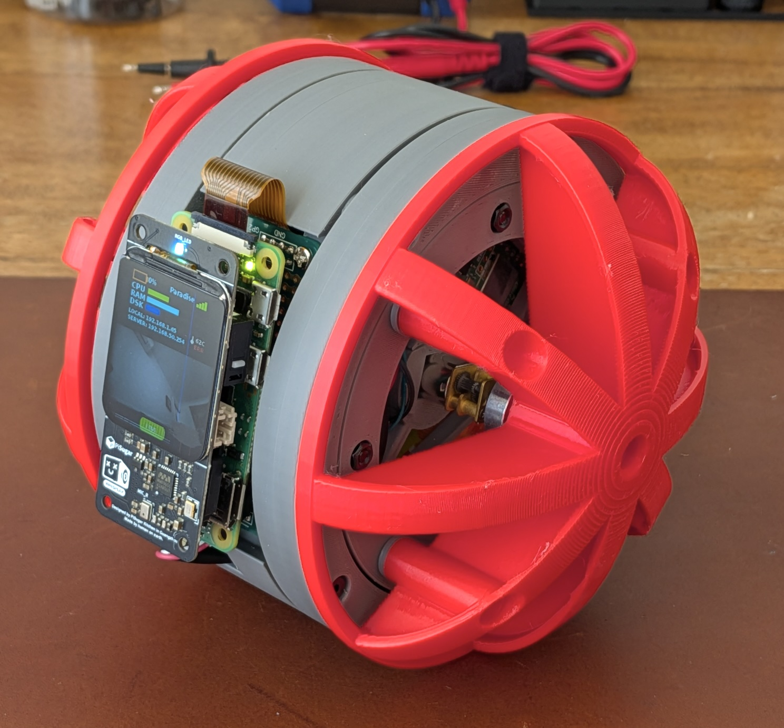&nbsp;&nbsp;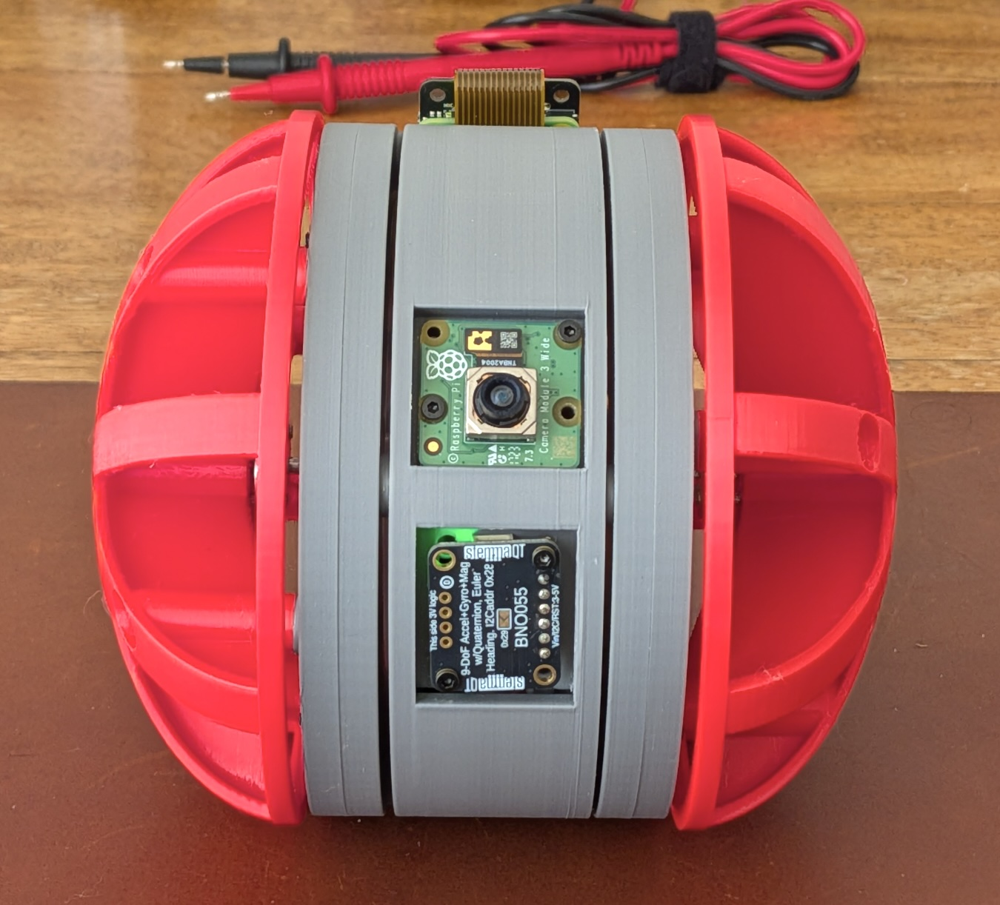

---

## Motivation

This project began with a simple wish: to have more photos and videos together with my son.

I came across [Samsung's concept robot Ballie](https://news.samsung.com/global/ballie-a-rolling-robotic-companion-from-samsung) — a cheerful, rolling ball that follows you around — and thought: *what if I built one myself?* A little companion that could chase us around the house and capture the everyday moments that are so easy to miss.

The project felt like the right kind of ambitious. Complex enough to keep me engaged for years, but tangible enough to make real progress in the hour I carve out each evening after he goes to sleep. It keeps my hands busy, my mind sharp, and — if it all works out — gives us a few more memories along the way.

---

## The Experiment: AI as Co-Engineer

This project started as a question: *how far can AI assistance extend beyond software development?*

The code is the least interesting part. Every engineering layer was designed in collaboration with AI models:

- **Mechanical design** — the slewing bearing rings, stator frame, cradle, and motor hubs were designed iteratively in OpenSCAD with AI help: from geometry constraints and print tolerance adjustments to resolving mechanical interference across 13+ versions of each part.

  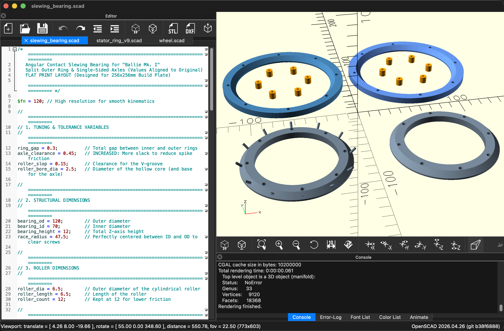

  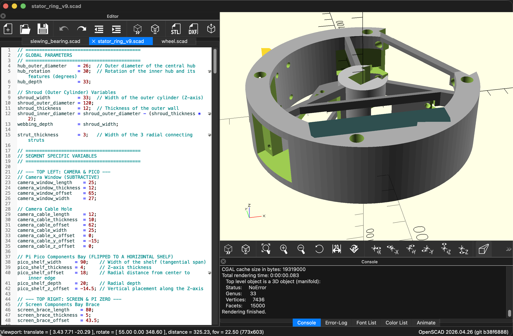

- **Electronic engineering** — wiring layout, component selection, pin assignment (including resolving conflicts between the Motor SHIM's DRV8833, I2C bus, and UART0), and power budgeting were all mapped with AI assistance from a YAML connection list rendered into a wiring diagram.

  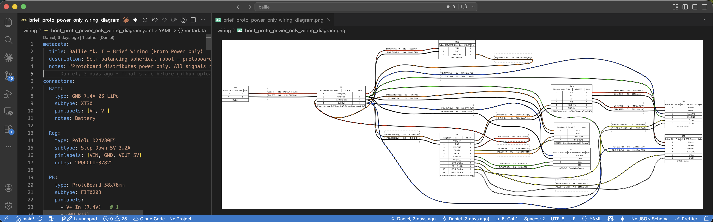

- **Embedded control** — the split-brain architecture, PID angle controller structure, and motor deadband calibration were designed and reasoned through with AI.

The robot is a physical artefact of that process. It exists to answer the question concretely.

**What AI is not doing (yet):** the models are not steering the robot. Autonomous navigation and perception are a future goal, likely with a small onboard model (Gemma-class). For now, Ballie is remote-controlled.

---

## How It Works

### The Drive Mechanism

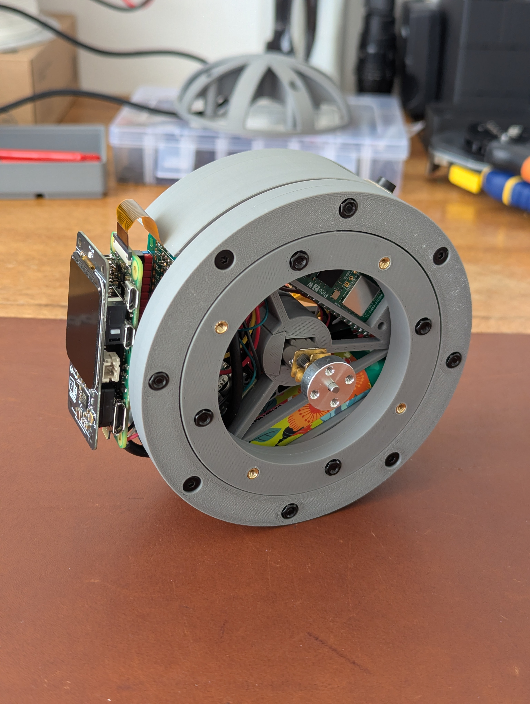

Inside the ball is a weighted internal platform — the *stator* — that hangs like a pendulum. Gravity pulls its battery-laden base downward, keeping it vertical. Two motors mounted on the stator drive the outer shell (the *rotor*) through 75mm slewing bearings. Because the stator resists rotation (gravity), the motor reaction force rolls the shell.

To roll forward: command the stator to pitch forward. The centre of mass shifts. The ball follows.

### Architecture: The Split Brain

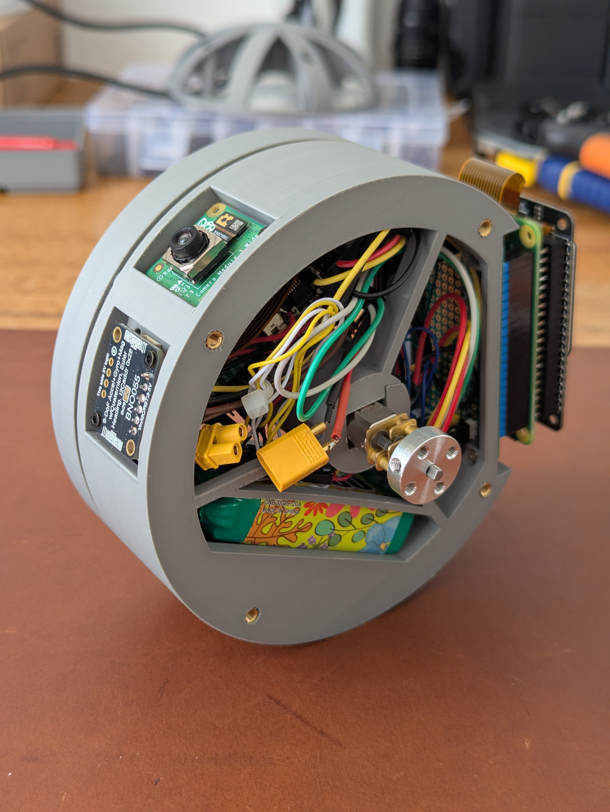

| Layer | Hardware | Role |
|---|---|---|
| Reflexes | Raspberry Pi Pico 2 W | 100 Hz PID angle control, IMU reading, raw motor PWM |
| Cognition | Raspberry Pi Zero 2 W | Camera streaming, high-level commands, future AI |
| Sensor | Adafruit BNO055 IMU | Absolute orientation via fused Euler angles |
| Driver | Pimoroni Motor SHIM | DRV8833 dual H-bridge for two gear motors |
| Display | WhisPlay (PiSugar 3 HAT) | Live camera feed + system HUD on a 240×280 LCD |

The Pico acts as an *angle-holding coprocessor*. It receives target pitch and yaw angles over UART and runs a PID loop to hold the stator at that angle — which causes the ball to move at the corresponding speed. The Pi Zero (or a dev machine via USB) sends commands:

```
<PITCH:12>   → hold stator at 12° forward tilt (ball rolls forward)
<YAW:5>      → apply differential steering offset
<STOP>       → emergency stop, target = 0°
```

---

## Hardware

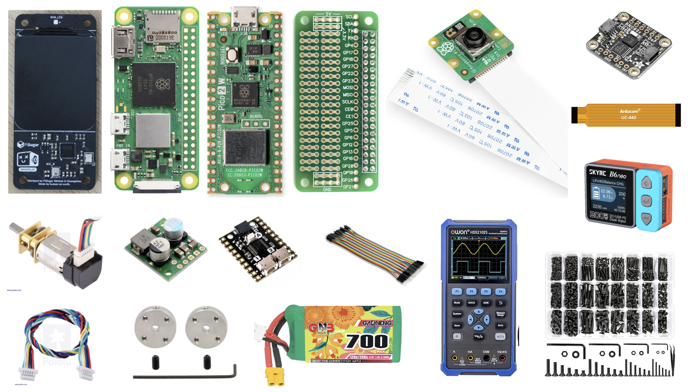

Full parts list, pin maps, and wiring tables: [docs/overview.md](docs/overview.md)

**Core components:**

| Qty | Component |
|---|---|
| 1 | Raspberry Pi Zero 2 W |
| 1 | Raspberry Pi Pico 2 W |
| 1 | Adafruit BNO055 9-DOF IMU (STEMMA QT) |
| 1 | Pimoroni Motor SHIM for Pico |
| 2 | Pololu 50:1 Micro Metal Gearmotor HP 6V (extended shaft + encoder) |
| 1 | Pololu 5V 3.2A Step-Down Regulator (D24V30F5) |
| 2 | 75mm Slewing Bearings |
| 1 | GNB 7.4V 2S LiPo (XT30) |
| 1 | PiSugar 3 Battery HAT |
| 1 | Raspberry Pi Camera Module 3 Wide |

---

## Build Guide

### 3D Printing

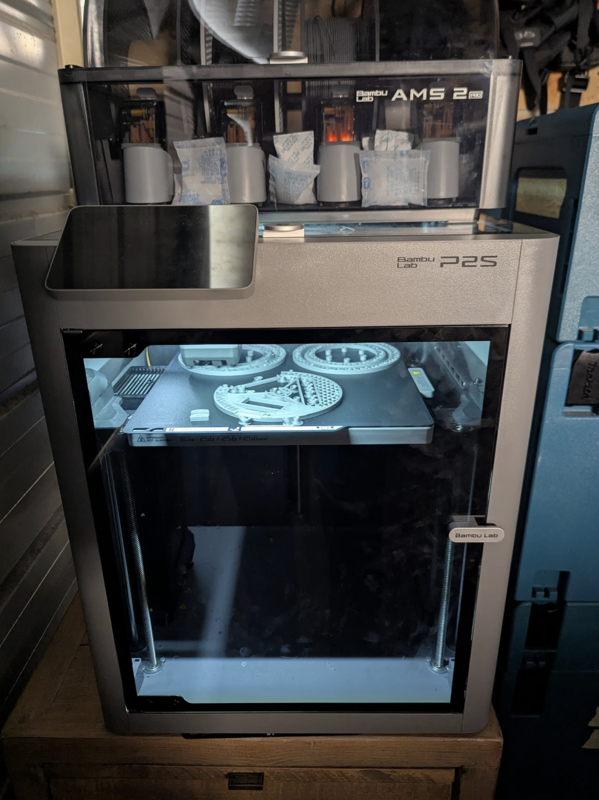

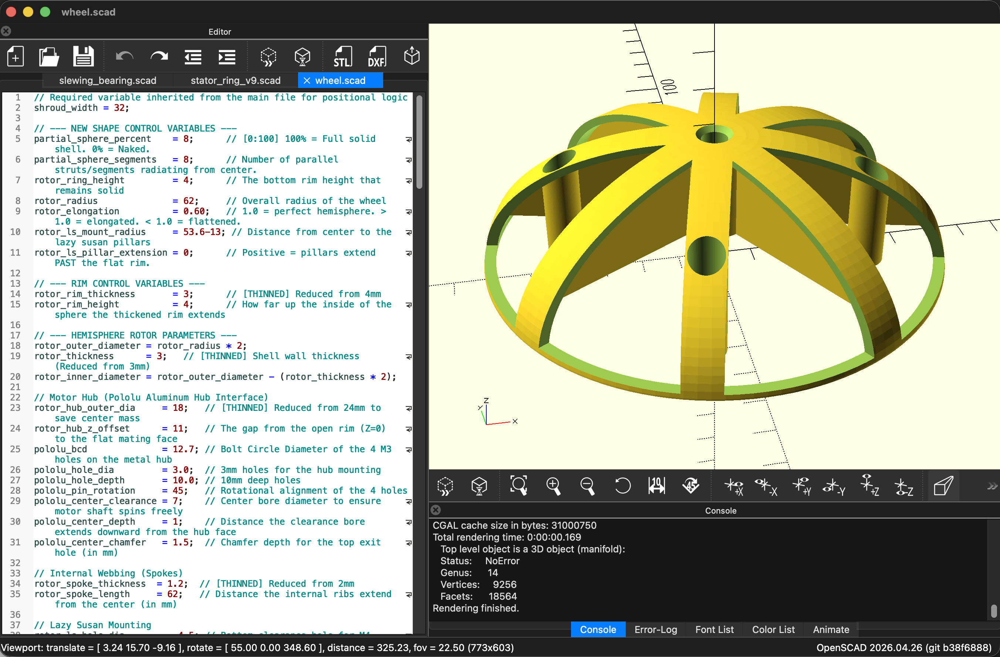

Print the following final STLs from [`cad/`](cad/):

| File | Part | Notes |
|---|---|---|
| `stator_ring_v13.stl` | Internal weighted cylinder | Main structural part |
| `wheel_v13.stl` | Motor wheel hubs | Print ×2 |
| `slewing_bearing_v6_half_plate.stl` | Slewing bearing ring (rigid) | Print ×2 per bearing |
| `slewing_bearing_flexible.stl` | Slewing bearing ring (TPU) | Alternative for grip |
| `cradle_v2.stl` | Electronics mounting cradle | Holds Pi + battery |

SCAD source files for all parts are in `cad/`. Intermediate design iterations are preserved in [`cad/archive/`](cad/archive/).

### Assembly and Wiring

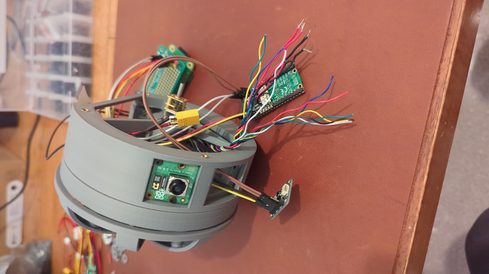
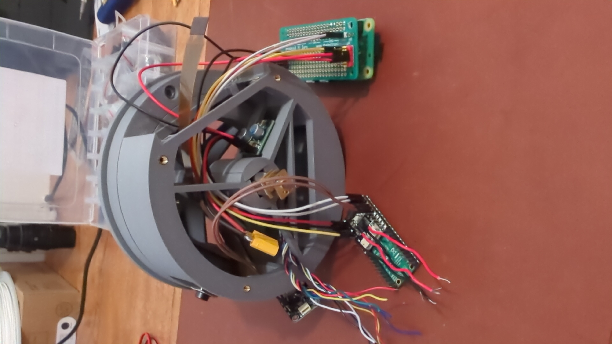
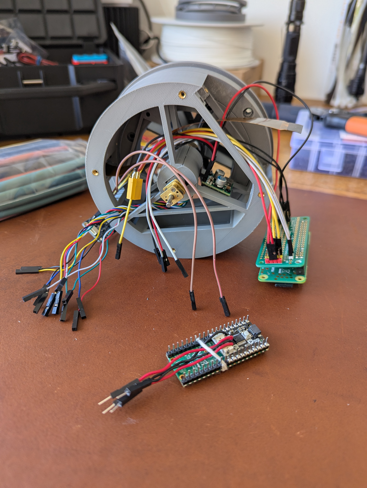

See [docs/overview.md](docs/overview.md) for:

- Full GPIO pin map (Motor SHIM, BNO055, UART, encoders)
- Step-by-step wiring tables with wire colours
- Assembly notes (SHIM sandwich, keel weight placement, cable routing)

---

## Software Setup

### Pico Firmware (MicroPython)

The Pico runs [Pimoroni MicroPython](https://github.com/pimoroni/pimoroni-pico) (v1.27.0+). Flash the UF2 via `sync_and_run_on_py.sh` (see below) or manually.

Deploy firmware files to the Pico:

```bash
python3 pico-shim-firmware/deploy_to_pico.py pico-shim-firmware/
```

The three firmware files are:
- `pico-shim-firmware/main.py` — PID angle controller (main loop)
- `pico-shim-firmware/boot.py` — UART init and boot banner
- `pico-shim-firmware/bno055_minimal.py` — BNO055 I2C driver stub (see note below)

> **BNO055 note:** In v0.1 the IMU driver is a stub. The Pico runs in *Direct Drive* mode, where `<PITCH:x>` maps directly to motor speed rather than a closed-loop angle. A full I2C driver is the next integration step.

### Pi Zero Setup

```bash
cd ballie/
cp config.py.example config.py       # fill in your values
bash install_dependencies.sh
```

---

## Usage

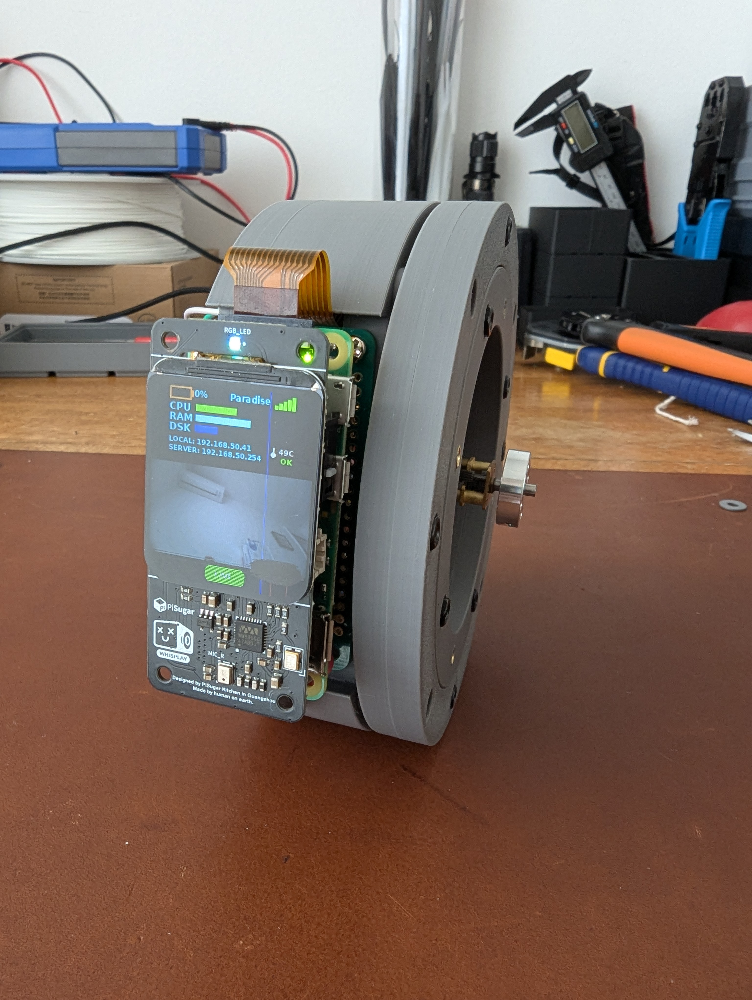

### Keyboard Control (dev machine via USB)

Connect the Pico via USB, then:

```bash
python3 pico-shim-firmware/keyboard_control.py
```

| Key | Action |
|---|---|
| W / ↑ | Pitch forward (roll forward) |
| S / ↓ | Pitch backward |
| A / ← | Yaw left |
| D / → | Yaw right |
| Space | Stop |
| +/- | Adjust pitch step size |
| R | Request status |
| Q | Quit |

### Full Deploy to Pi Zero

```bash
cd ballie/
cp sync_config.sh.example sync_config.sh   # fill in Pi IP and credentials
bash sync_and_run_on_py.sh                 # sync + run in foreground
bash sync_and_run_on_py.sh background on   # install as a systemd service
```

---

## Current State — v0.1

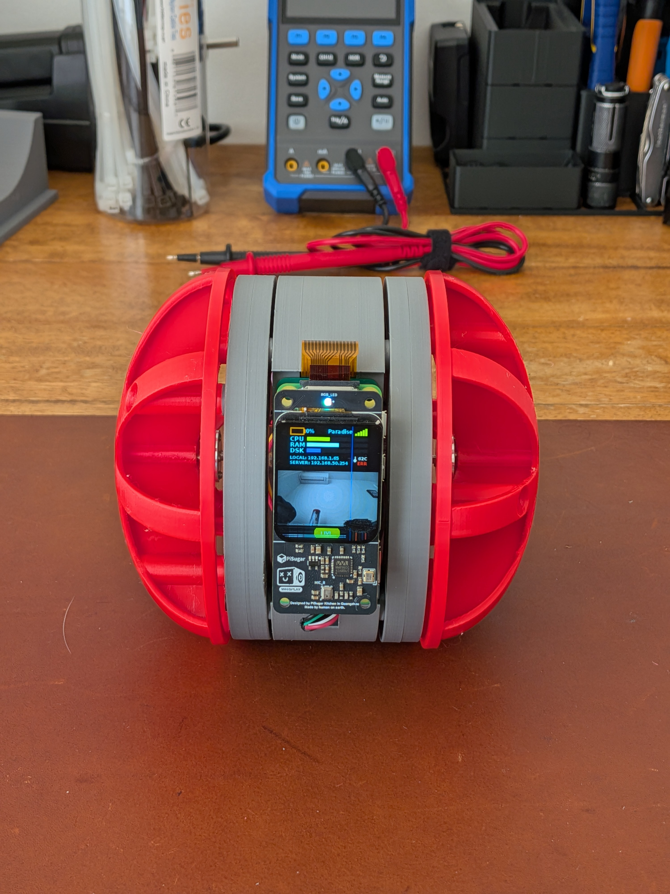
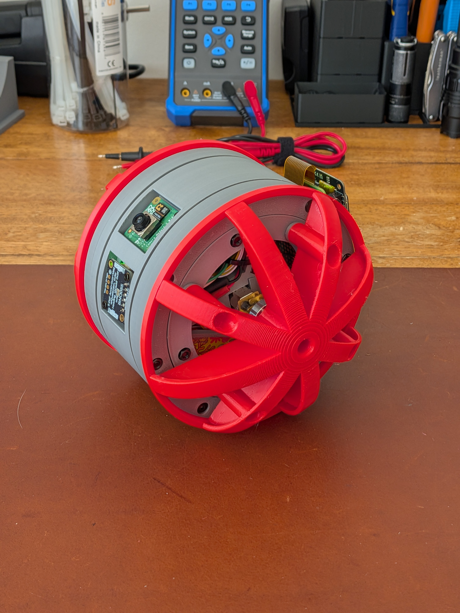
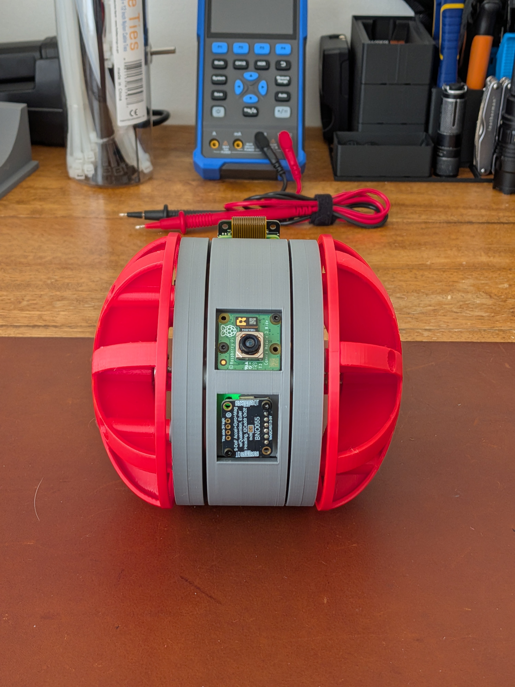

A short clip of it rolling: [`images/ball_rolling.mp4`](images/ball_rolling.mp4).

**Working:**
- Physical drive mechanism — ball rolls from pendulum mass shift
- Motor PID velocity loop with encoder feedback
- Camera feed with live system HUD (battery, CPU, WiFi, temperature) on WhisPlay display
- Short-press button: start/stop video + audio recording (auto-muxed to MP4)
- Long-press button: toggle demo mode (sends `<PITCH:30>` to Pico)
- Keyboard control from dev machine (USB) or Pi Zero (UART)

**Not yet integrated:**
- BNO055 IMU closed-loop angle control (currently Direct Drive — stator angle is not sensed)
- End-to-end Pi Zero → Pico UART path (wired, integration untested)
- Onboard AI inference

---

## Next Iteration

The v0.2 goal is to rebuild the control loop in simulation, removing the hardware barrier entirely:

- **Microcontroller sim** — replace the physical Pico with a simulated ESP32 running in [Wokwi](https://wokwi.com/)
- **Physics sim** — a pendulum-in-sphere model (PyBullet or a lightweight 2D pendulum sim) to replace the physical ball
- **Environment sim** — simulated terrain and synthetic camera input
- **AI inference** — a Gemma-class model receiving camera frames and issuing `<PITCH>` / `<YAW>` commands

This makes the project forkable and runnable without hardware, enables RL-based PID tuning, and is a prerequisite for training end-to-end navigation policies.

---

## License

[MIT](LICENSE) — Daniel Martinez Formoso, 2025
